# Iftakher Uddin Rishad

**Software Engineer · Full-Stack Developer · Problem Solver**

`Dhaka, Bangladesh · git push --force with confidence`

Building web applications, REST APIs, and business systems that ship to production — and stay maintainable afterwards.

 

| | |
| :-: | :-: |
|  |  |

 

---

## About

I build production software end to end — Laravel and Node.js services, REST API design, relational data modeling with MySQL and PostgreSQL, and the React + TypeScript interfaces that consume them.

My work is mostly business-focused: HR systems, e-commerce platforms, and operational tooling that real teams depend on. I care about clean boundaries, readable code, and systems that behave predictably under real usage.

---

## Engineering Focus

| | |
| :- | :- |
| **Backend Engineering** <samp>REST APIs · business logic · data flows on Laravel and Node.js.</samp> | **Frontend Engineering** <samp>React + TypeScript interfaces, styled with Tailwind CSS or Bootstrap, bundled with Vite.</samp> |
| **Data & Architecture** <samp>Relational modeling, Prisma ORM, and API design behind production systems.</samp> | **Tools & Infrastructure** <samp>Git · GitHub · Postman · VS Code — deploying to Vercel and Netlify.</samp> |

---

## Selected Projects

| | |
| :- | :- |
| **HRM · Godrej Bangladesh** <samp>Human resource management system for Godrej Bangladesh, delivered on a maintainable backend.</samp> <samp>Laravel · Node.js · REST APIs</samp> [View Repository →](https://github.com/goldeninfotech/godrej-backend) | **E-Commerce · Shopilo** <samp>E-commerce platform for Shopilo, covering the core storefront and commerce workflow.</samp> <samp>React · Laravel · REST APIs</samp> [View Repository →](https://github.com/Rishad05/shopilo-ecom) |
| **Desievent Go** <samp>Backend for Desievent Go's event management workflows.</samp> <samp>Laravel · Node.js · MySQL</samp> [View Repository →](https://github.com/DesiEventsGO/desieventsgo-backend) | **Fuel Pass** <samp>Fuel distribution pass management backend.</samp> <samp>Laravel · MySQL · REST APIs</samp> [View Repository →](https://github.com/goldeninfotech/fuel-pass-backend) |
| **Moitri Somiti** <samp>Platform managing co-operative society operations.</samp> <samp>Laravel · MySQL · REST APIs</samp> [View Repository →](https://github.com/goldeninfotech/moitri) | |

---

## GitHub Activity

Auto-refreshed daily by GitHub Actions — no API key required.

---

## Tech Stack

**Languages** &nbsp;·&nbsp; <samp>PHP · JavaScript · TypeScript · SQL</samp>

**Backend** &nbsp;·&nbsp; <samp>Laravel · Node.js · Express.js · Prisma ORM · REST APIs</samp>

**Frontend** &nbsp;·&nbsp; <samp>React · TypeScript · Vite · Tailwind CSS · Bootstrap</samp>

**Databases** &nbsp;·&nbsp; <samp>MySQL · PostgreSQL</samp>

**Tools** &nbsp;·&nbsp; <samp>Git · GitHub · VS Code · Postman · Vercel · Netlify</samp>

---

## Currently Building

| Building | Learning | Engineering Notes |
| :--- | :--- | :--- |
| HRM systems for Godrej Bangladesh | Distributed systems & backend scalability | Clean architecture over clever hacks |
| E-commerce systems for Shopilo | Go for high-throughput backend services | API-first thinking |
| Business automation platforms | Cloud infrastructure | Terminal-first workflows |

---

## Achievements

---

## Let's Connect

Prefer a direct conversation? Reach me at **[iu.rishad5@gmail.com](mailto:iu.rishad5@gmail.com)** or book a look at my [portfolio](https://my-portfolio05.web.app/).

---

**Iftakher Uddin Rishad** · Software Engineer · `Dhaka, Bangladesh`

`Build → Ship → Learn → Repeat`

